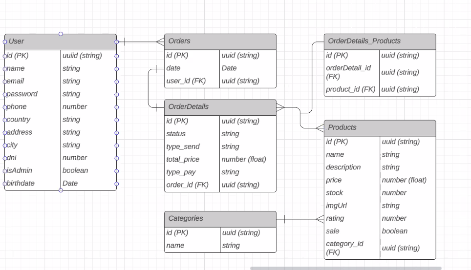

# E-commerce Genérico del Módulo 4 del Bootcamp "Soy Henry"

Este proyecto representa la culminación del aprendizaje y la aplicación de buenas prácticas en el desarrollo de software, específicamente en el ámbito de comercio electrónico. Diseñado como parte del Módulo 4 del Bootcamp de Desarrollo Web Full Stack en Soy Henry, el E-commerce Genérico es una aplicación robusta que abarca la implementación e integración de las mejores prácticas en el desarrollo de software.

---

<br>

### Indice:
- [descripción](#instalación)
- [tecnologías](#instalación)
- [funcionalidades](#instalación)
- [ejemplos](#instalación)
- [instalación](#instalación)

<br>
<br>

<br>
<br>
<br>

## Descripción del Proyecto

El E-commerce Genérico es una plataforma de comercio electrónico completa, desarrollada siguiendo una arquitectura de microservicios. Esta arquitectura modular nos permite descomponer la aplicación en componentes independientes, facilitando el mantenimiento, escalabilidad y despliegue.


<br>
<br>
Esquema de tablas :



<br>
<br>

## Tecnologías Utilizadas

- **NestJS:** Framework de Node.js para aplicaciones escalables en el servidor.
- **TypeScript:** Amplía JavaScript con tipos estáticos opcionales.
- **PostgreSQL:** Sistema de gestión de bases de datos relacional de código abierto.
- **TypeORM:** ORM para simplificar la interacción con la base de datos.
- **JWT:** Estándar para autenticación y transmisión segura de datos.
- **Bcrypt:** Garantiza la seguridad en la aplicación mediante hash de contraseñas.
- **Swagger:** Simplifica la documentación y prueba de APIs RESTful.
- **Docker:** Plataforma de contenedores para desarrollo, implementación y ejecución de aplicaciones.

<br>
<br>

## Funcionalidades Principales

- **Gestión de usuarios:** Registro, inicio de sesión y gestión de perfiles de usuario.
- **Catálogo de productos:** Visualización, búsqueda y filtrado de productos.
- **Carrito de compras:** Agregar, modificar y eliminar productos del carrito.
- **Proceso de pago:** Integración de pasarelas de pago para realizar transacciones seguras.
- **Gestión de pedidos:** Seguimiento y gestión del estado de los pedidos realizados.

<br>
<br>

### GET /user/

- **Descripción:** Obtiene todos los usuarios.
- **Query Params:** page : number , limit : number

- **Respuesta:**

  - **200**: Si hay usuarios registrados.
  - **404**: Si no hay usuarios registrados aún.
  - Si no se envian querys, por default devuelve toda la lista completa de usuarios

- **Ejemplo:**

  ```json

    [

        {
          "id": "5619be4c-64a5-462b-8c8f-8078ba186f4b",
          "name": "Chayane",
          "email": "chayane@gmail.com",
          "phone": 1183629205,
          "country": "United States",
          "city": "Nevada",
          "address": "avenida siempre viva 742",
          "role": "USER",
        },

        {
          "id": "1312fe2g-14z1-221l-1g5a-3378zg026f4b",
          "name": "Ricky Martin",
          ...
        }

    ]

  ```

### GET /users/:id

- **Descripción:** Obtiene un usuario por su id junto con sus ordenes de compra realizadas.
- **Parámetros:** id: debe ser un string con formato UUID v4.

- **Respuesta:**

  - **200**: Si el usuario fue encontrado.
  - **404**: Si el usuario no fue encontrado.
  - Si el usuario tiene ordenes de compra realizadas en el array se vera reflejado el id, fecha y hora en el que fue realizada la orden.

- **Ejemplo:**

  ```json

    {
      "id": "5619be4c-64a5-462b-8c8f-8078ba186f4b",
      "name": "Chayane",
      "email": "chayane@gmail.com",
      "phone": 1183629205,
      "country": "United States",
      "city": "Nevada",
      "address": "avenida siempre viva 742",
      "role": "USER",
      "orders":[]
    },

  ```

<br>
<br>

## Instalación

1. Clona este repositorio en tu máquina local.
1. Instala las dependencias utilizando npm install.
1. Configura las variables de entorno según sea necesario.
1. Ejecuta el servidor de desarrollo con npm run start:dev.
1. Accede a la aplicación en tu navegador web mediante la URL proporcionada por el servidor.
